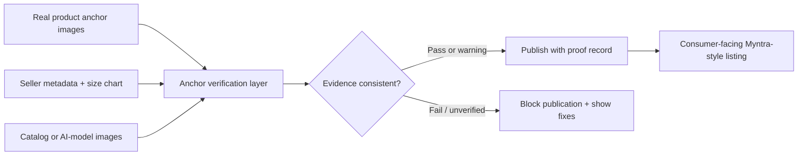
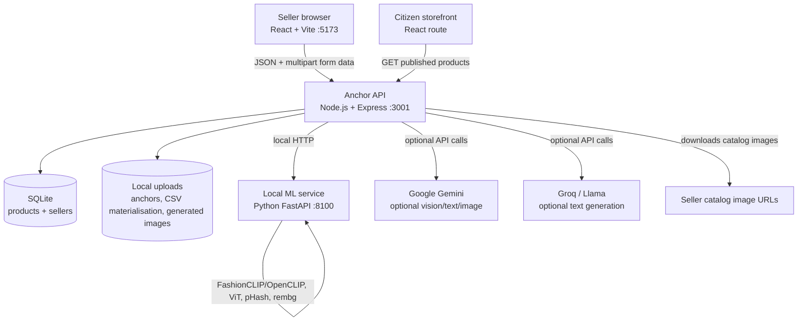
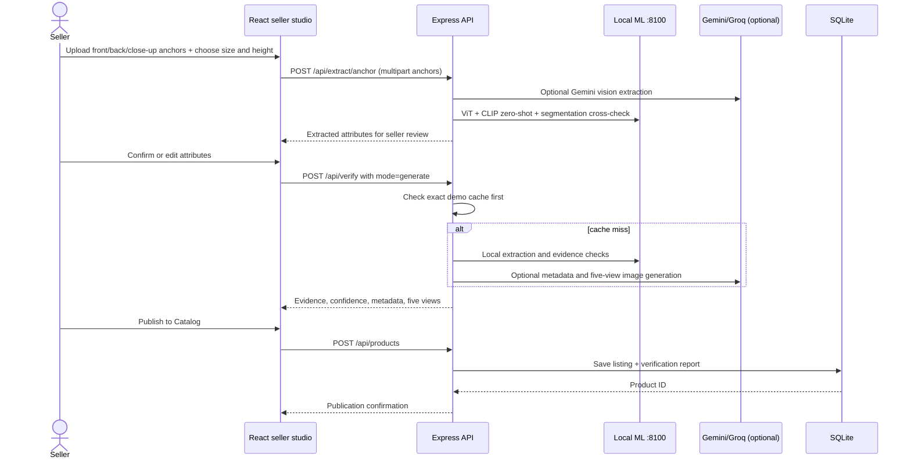
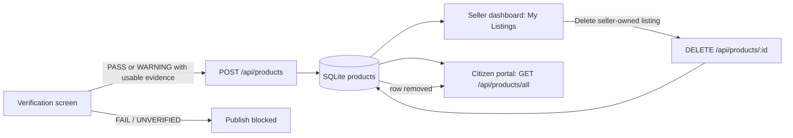

# Anchor — Technical Design & Pitch Preparation Guide

> **Version:** current local demo build  
> **Product:** an AI-assisted verification layer between a seller's product data and the consumer-facing catalog.

## 1. The product in one sentence

Anchor makes fashion listings more trustworthy by treating a real product photo as the **anchor** and checking that seller metadata, catalog imagery, size information, and generated content stay consistent with it before publication.

The core idea is not "generate more listings." It is **verify that the listing a customer sees is faithful to the physical garment**.

## 2. The problem and the design principle

Fashion catalog content can be wrong in several independent ways:

- Product photos may show a different colour, print, fit, or garment length.
- Generated model photos can lose a back print, change the fabric texture, or misrepresent body/size context.
- Seller-entered metadata and size-chart measurements can contradict the visible product.

Anchor solves this with a three-source consistency check:



The real product images are deliberately the source of truth. AI can help generate imagery and copy, but it cannot silently replace the evidence.

## 3. System architecture



### Runtime services

| Service | Default port | What it does | Why it exists |
|---|---:|---|---|
| React + Vite frontend | `5173` | Seller studio, verification screen, dashboard, shopper routes | Fast interactive UI and browser-side file selection/previews |
| Node.js + Express API | `3001` | Authentication, uploads, CSV processing, verification orchestration, product persistence | Coordinates the business workflow and exposes one API surface to the UI |
| Python FastAPI ML service | `8100` | CLIP similarity/zero-shot, multi-head ViT inference, segmentation, pHash | Keeps local vision-model execution separate from the web/API process |
| SQLite | local file | Sellers, products, verification records, publication state | Lightweight persistent storage for the demo |
| Local uploads directory | `backend/uploads/` | Uploaded anchors, downloaded CSV image evidence, generated/pregenerated image assets | Allows the backend and frontend to use stable local image URLs |

## 4. What is used where — and why

| Area | Technology | Used in | Why it is used there |
|---|---|---|---|
| Seller and citizen UI | React 19 | `frontend/src` | Component-based UI for multi-step listing, verification evidence, dashboard, and storefront |
| Frontend tooling | Vite | `frontend/vite.config.js` | Fast local development and production bundling |
| Navigation | React Router | `frontend/src/App.jsx` | Separates seller routes from public/citizen routes and protects seller-only views |
| Shared workflow state | React Context | `frontend/src/AppContext.jsx` | Carries selected anchors, CSV row, extracted attributes, verdict, and publish state across pages without re-uploading files |
| Icons | Lucide React | pages/components | Accessible, consistent UI iconography without custom image assets |
| CSV preview | PapaParse | `NewListing.jsx` | Parses the seller-selected CSV immediately in the browser before it is submitted |
| API server | Express 4 | `backend/server.js` | Routes requests, applies CORS/JSON limits, serves uploads, and orchestrates services |
| Upload handling | Multer | `backend/server.js`, CSV routes | Accepts multipart anchors, catalog photos, size charts, and CSVs safely with file limits |
| Database | better-sqlite3 | `backend/services/database.js` | Synchronous, simple local persistence for sellers and published listings |
| Login | JWT + SHA-256 demo hashing | `routes/auth.js` | Keeps seller dashboard access scoped to a signed-in seller in the demo |
| CSV parsing/export | `csv-parse` + `csv-stringify` | `routes/csv.js` | Converts seller template rows to objects and returns updated downloadable CSVs |
| Image transformation | Sharp | verification + generation services | Reads pixel data for geometry checks, slices generated composites, and creates local fallback imagery |
| Local visual similarity | FashionCLIP/OpenCLIP | `services/ai_server.py` | Compares anchor and catalog image embeddings without relying on an LLM judgment |
| Local attribute classifier | multi-head ViT | `services/ai_server.py` | Predicts core garment properties such as type, colour, sleeve, neck, fabric/length when model weights are available |
| Local zero-shot attributes | CLIP text/image comparison | `services/ai_server.py` | Classifies supplementary attributes from controlled label sets without retraining each label |
| Structural image similarity | perceptual hash (pHash) | `services/ai_server.py` | Detects very similar image structure; helpful alongside CLIP for duplicate/near-duplicate evidence |
| Garment isolation | rembg segmentation | `services/ai_server.py` | Produces a garment cutout for length/shape checks and a non-AI image fallback |
| Optional vision/text intelligence | Google Gemini | `services/gemini.js` | Vision attribute extraction/enhancement, text fallback, and five-panel generated model imagery when configured |
| Optional listing copy | Groq Llama 3.3 | `services/groq.js` | Generates structured SEO title, description, tags, and merchandising fields from verified text attributes |

## 5. Key data objects

### Seller/product record

The `products` table stores the public listing and its proof trail in one record:

- Commercial data: style code, brand, title, description, prices, category, tags.
- Declared/extracted evidence: `attributes`, `size_chart`, `seller_metadata`.
- Images: `anchor_image_url`, `catalog_images`, `ai_model_images`.
- Trust record: `verification_status`, `verification_score`, `verification_report`, and `suggestions`.
- Publication state: `published_at`.

JSON fields are stored as JSON text in SQLite and converted back to objects in `database.js` when read.

### Verification response

`POST /api/verify` returns a structured evidence packet:

```text
comparison[]                 one row per verified attribute/evidence check
catalog_attributes           extracted catalog-side attributes
modelIssues[]                high/medium severity image or fit problems
fabricResult                 close-up/texture consistency evidence
phashResult                  image structural similarity result
fusionResult                 Bayesian score and likelihood-ratio breakdown
verdict                      PASS / WARNING / FAIL / UNVERIFIED
corrections[]                evidence-backed seller corrections
suggestionAgent              prioritized consistency actions
catalogEvidenceDiagnostics   whether each catalog URL/view was usable
sizeChartEvidence            parsed measurement evidence
generatedMetadata            generated title/copy/tags/category/image URLs
enhancedMetadata             improved listing metadata for CSV verification
```

## 6. End-to-end flows

### A. Guided “generate listing” flow

This is the demo flow used for an anchor product without pre-existing catalog images.



### B. CSV verification flow

This flow starts with a seller’s existing catalog-style CSV and validates the corresponding anchor photos.

1. Seller selects a category and downloads a template, or uploads an existing CSV.
2. `POST /api/csv/upload` parses the CSV and detects image URL columns.
3. The backend downloads each HTTP(S) catalog image in parallel, validates that it is an image, saves a local working copy, and retains the original URL as source data.
4. The seller uploads the real product anchor images.
5. The UI sends anchors, resolved catalog URLs, seller metadata, and size-chart measurements to `POST /api/verify`.
6. Anchor compares physical evidence, catalog evidence, and declared rows. It reports missing views, mismatch rows, size/length conflicts, and model/body issues.
7. The seller can edit approved metadata on the verification page.
8. Publishing creates the shared product record and writes verification outcome fields back into the in-memory CSV session’s `published` stage.
9. The seller can download the updated CSV; the browser download is blob-based, so it does not navigate away from the studio.

### C. Publication and consumer visibility



The publish gate blocks `FAIL`, `UNVERIFIED`, or evidence-less results. A `WARNING` can still be published, but its verification record remains attached so the decision is auditable.

## 7. Verification pipeline — what happens after `POST /api/verify`

### Step 0: Evidence preparation

- Parses `declaredAttrs` and previously extracted anchor values.
- Separates multipart files into anchor images, catalog images, and an optional size chart.
- If catalog images arrive as URLs from CSV, the backend materialises them locally. It uses a 15-second timeout, image-content-type validation, and a 15 MB maximum file size.
- Tracks a diagnostic for every catalog view so unavailable links lower confidence rather than silently disappearing.

### Step 0.5: Intentional demo cache

The project has a strict cached demo result for the checked-in `prod_crop` scenario: recognised anchor hash, pink crop top, size `M`, and height `5'4"` in `generate` mode. It returns the curated five-view asset set and its precomputed evidence packet immediately.

This is a **demo acceleration path**, not the general verification path. CSV verification is configured to inspect the seller’s current image evidence unless a cache flag is explicitly supplied.

### Layer 1: Visual identity gate

| Check | Implementation | Purpose |
|---|---|---|
| CLIP cosine similarity | Node calls `POST http://localhost:8100/clip/similarity` | Broad semantic check: “does this catalog image look like the same garment as the anchor?” |
| pHash distance | Node calls `POST http://localhost:8100/phash` | Structural/near-duplicate signal; useful because CLIP and pHash fail in different ways |

Low CLIP similarity becomes a high-severity issue. The normal path continues to show the seller precise reasons; an optional `stopAtVisualGate` switch can force a hard-stop response.

### Layer 2: Attribute extraction

The pipeline needs structured values rather than a vague “looks similar” score. It extracts garment type, colours, pattern, fabric appearance, overall length, sleeves, neck, silhouette, fit, embellishment, transparency, hemline, occasion, motif, closure, and structural features.

The current extraction order is:

1. **Gemini Vision when keys are configured** — detailed multi-image extraction from controlled enum prompts.
2. **Local multi-head ViT** — cross-checks core attributes such as garment type, colour, sleeve, neck, length, and fabric.
3. **Local CLIP zero-shot** — fills supplementary attributes from controlled label choices.
4. **Segmentation/geometry** — adds an independent length signal.
5. **Fallback** — low-confidence text/template data only if every extractor is unavailable, so the UI can fail safely rather than crash.

Catalog extraction uses the same local fallback, and may use Gemini Vision jointly on anchor and catalog images when configured.

### Layer 3: Deterministic three-way comparison

This is where Anchor’s trust logic lives. It compares:

```text
anchor image attributes  ↔  catalog image attributes  ↔  seller-declared metadata
```

The comparison is code-based, not an LLM’s final opinion:

- Normalises values and handles structured `{ value, confidence, source }` attributes.
- Uses synonym mappings so equivalents such as “crew neck” and “round neck” are not needlessly flagged.
- Weights structural attributes more heavily than soft attributes.
- Checks whether all five catalog views — Front, Back, Side, Close-up, Full body — are present.
- Uses Sharp pixel/foreground geometry to estimate visible garment length and model build.
- Cross-checks back-print preservation when back-view evidence exists.
- Compares close-up anchor/catalog views for fabric texture consistency with CLIP.
- Checks apparent model height/build against selected model size and height.
- Validates declared length against the selected size chart and then compares the visible catalog length against that measurement family.

### Layer 4: Bayesian evidence fusion

The UI score is not just one model’s confidence. The code starts with a 50% prior and updates the odds with three evidence streams:

```text
Posterior odds = Prior odds × LR(CLIP) × LR(pHash) × LR(attributes)
Posterior probability = Posterior odds / (1 + Posterior odds)
```

Where:

- Higher CLIP similarity provides a stronger positive likelihood ratio.
- pHash is positive evidence for close structural matches, but is intentionally not harshly negative for different camera angles.
- Attribute matches add evidence; high-severity attribute mismatches subtract more strongly than soft differences.
- Likelihood ratios are capped to avoid false certainty.

The response exposes the prior and each likelihood ratio, so the score can be explained on the verification page and in a pitch.

### Layer 2.5: Suggestions and correction co-pilot

The backend builds a plain structured `Anchor Consistency Copilot` object from comparison rows and issues. It prioritises what the seller should change, the suggested value/action, and the consumer impact.

Examples:

- “Replace or regenerate the catalog views so the garment visibly keeps the declared length.”
- “Use a catalog model whose visible proportions credibly represent size M.”
- “Provide all five catalog views before publishing.”

### Layer 5: Listing enhancement and catalog generation

This layer is separate from the core decision. It creates title, description, tags, category, and optional five-view imagery **after the evidence process**, not in place of it.

## 8. How generation works

### A. Metadata and tags

The system takes verified/declared attributes and produces:

- SEO-aware title and description.
- Automated trend/aesthetic tags such as Y2K, streetwear, festive, dark academia, indie, or coquette when supported by the product evidence.
- Myntra-style category path, for example `Women > Western Wear > Tops > Crop Tops`.
- Features, fabric notes, wash care, and size/fit notes.

Fallback order for structured listing copy:

1. Groq Llama text generation, if a Groq key is available.
2. Gemini text generation, if Gemini keys are available.
3. Deterministic template generated from attributes, so the listing workflow still works without an external LLM.

The current generate/CSV verification route also uses `enhanceMetadataWithVision`, which uploads an anchor image to Gemini when configured and asks for fashion-specific title, description, tags, and category. If it is unavailable, it retains/falls back to seller data rather than failing publication.

### B. Five-angle AI model images

Generation creates an intended five-angle set:

1. Front, full body
2. Back, full body and back detail/print
3. Side profile and drape
4. Close-up of neck/fabric/construction
5. Full-body editorial image

The requested size and height control the body description sent to generation:

| Selected size | Prompt body context |
|---|---|
| XS | petite, slim build |
| S | slim, lean build |
| M | average, regular build |
| L | slightly curvy, regular-to-full build |
| XL | full-figured, curvy build |
| XXL | plus-size, full-figured build |

Generation resolution order:

1. **Pregenerated variant cache** — looks for the exact product/size/height/view asset in `uploads/pregenerated`. This makes the pitch demo deterministic and avoids a live model changing its result halfway through a demo.
2. **Gemini image generation** — if a configured image-capable Gemini model is available, Anchor sends the anchor image, optional size chart, and a five-panel prompt. It asks for one composite image with one consistent model identity, then uses Sharp to slice it into five view files.
3. **Local image fallback** — if image generation is unavailable, it segments the garment and composites it on a neutral mannequin. This prevents broken image cards but is intentionally marked as an AI-model fallback.

### Why a grey figurine can appear

The grey figurine is the third, local fallback. It appears when no matching pregenerated five-view asset is found and Gemini image generation is not available or fails. It is a continuity fallback, not a successful photorealistic AI-model result. The correct pitch-demo approach is to use the cached `prod_crop` M/5'4" combination, which resolves the curated model images first.

## 9. API map

### Browser → Anchor API (`http://localhost:3001/api`)

| Method and endpoint | Called from | Request | Response / purpose |
|---|---|---|---|
| `POST /auth/login` | `Login.jsx` | email, password | JWT plus seller identity |
| `POST /auth/register` | API-ready route | email, password, business name | Creates a demo seller and JWT |
| `GET /auth/me` | API-ready route | Bearer JWT | Current seller |
| `POST /extract/anchor` | `NewListing.jsx` | multipart `images[]` | Extracted anchor attributes |
| `POST /verify` | `Verify.jsx` | multipart anchors/catalog/size chart plus declared metadata | Full evidence, verdict, confidence, suggestions, generated metadata |
| `GET /csv/template?category=` | CSV download helpers | selected category | Category-specific CSV template |
| `POST /csv/upload` | `NewListing.jsx`, `ExcelView.jsx` | CSV file | Session ID, parsed preview, resolved-image diagnostics |
| `GET /csv/:sessionId` | `ExcelView.jsx` | session ID | Original/current/generated/published stages |
| `POST /csv/:sessionId/update` | `Verify.jsx` | row updates and stage | Updates generated/published CSV row |
| `GET /csv/:sessionId/download/:stage` | CSV download helper | session/stage | Updated CSV download |
| `POST /sizechart/parse` | API-ready route | CSV/image size-chart file | Measurement JSON in inches |
| `GET /products` | seller dashboard | Bearer JWT | Seller-owned product records |
| `GET /products/all` | citizen portal | none | All product records; UI displays published ones |
| `GET /products/:id` | shopper product detail | product ID | One product and its evidence fields |
| `POST /products` | `Verify.jsx` publish action | listing + verification record | Saves the listing |
| `DELETE /products/:id` | `Dashboard.jsx` | Bearer JWT | Removes only the owner’s record from seller and citizen catalog views |
| `GET /health` | diagnostics | none | Runtime architecture/status summary |

### Node API → local ML service (`http://localhost:8100`)

| Endpoint | Used for |
|---|---|
| `POST /clip/similarity` | Anchor-to-catalog semantic visual similarity |
| `POST /clip/zero-shot` | Supplementary controlled-label garment attributes |
| `POST /clip/binary-batch` | Confirms proposed correction alternatives where applicable |
| `POST /vit/predict` | Core multi-head garment attribute classification |
| `POST /segment` | Foreground/cutout and approximate garment length signal |
| `POST /phash` | Perceptual image hash distance |

### Node API → external services

| Service | When it is called | Data sent | Purpose |
|---|---|---|---|
| Gemini Vision | Only when Gemini keys are present | Anchor and/or catalog images plus controlled prompts | Detailed attribute extraction and trend metadata enhancement |
| Gemini image model | Cache miss + configured model/key | Anchor image, optional size chart, five-panel prompt | Photorealistic five-view model catalog generation |
| Gemini text | Groq unavailable or failed | Verified attributes only | Structured listing metadata fallback |
| Groq Llama text | Groq key available | Verified attributes only | Structured product title, description, tags, and category data |
| Seller image host | CSV/URL verification | Server fetches seller-provided catalog URLs | Materialises image evidence locally before analysis |

## 10. Truthful pitch language: what to say and what not to overclaim

### Strong, accurate claims

- “Anchor makes the real product image the source of truth and compares it against metadata and catalog imagery.”
- “The final publication decision is evidence-driven: visual similarity, structured attribute comparison, geometry/size checks, and Bayesian fusion.”
- “We preserve a verification record with every published listing, instead of only saving generated marketing copy.”
- “We can catch concrete customer-facing failures such as wrong colour, garment length, missing back-print preservation, weak fabric evidence, incomplete angles, and size-chart/image conflicts.”
- “The consumer portal reads the same published product record as the seller portal. Deleting a seller listing removes the public listing too.”

### Important implementation caveat

The code comments describe layers 1–4 as local/zero-paid-call verification. In the **current configuration**, Gemini Vision is also used as an optional extractor/enhancer whenever keys are present. The deterministic comparison, geometry checks, pHash, CLIP, Bayesian fusion, and final gate remain local/code-based, but image analysis can be externally assisted.

For a precise pitch, say:

> “Our verification decision is an evidence-fusion system with local fallbacks. We optionally use Gemini for richer vision extraction and generation, while the decision logic, comparisons, and audit trail remain explainable and deterministic.”

Do **not** say “the whole current pipeline always makes zero external calls” unless Gemini vision/enhancement is disabled for that run.

### Current demo boundaries — answer honestly if asked

| Area | Current demo behaviour | Production next step |
|---|---|---|
| Authentication | JWT; demo password hashes use SHA-256 | bcrypt/Argon2, secure secret rotation, RBAC |
| CSV session data | Stored in memory, so it resets on backend restart | Store sessions/rows in durable database or object storage |
| Files | Local disk under `uploads/` | Encrypted object storage with signed URLs and retention rules |
| AI model deployment | Local FastAPI process expected at port 8100 | Containerise/serve autoscaled inference with monitoring |
| Generated images | Uses cache, Gemini image generation, then mannequin fallback | Dedicated image generation pipeline with garment-preservation evaluation |
| Bayesian score | Transparent, heuristic likelihood ratios | Calibrate likelihood ratios against labelled historic mismatch/return data |
| Marketplace integration | Local Myntra-style citizen portal | Marketplace catalog, moderation, and seller APIs |

## 11. Likely pitch questions and strong answers

### Product and value

1. **Why is this better than simply generating better product photos?**  
   Generation improves speed; it does not prove truth. Anchor adds a verification checkpoint against physical-product evidence, so it addresses the trust and returns problem rather than only the content-production problem.

2. **What exactly is the anchor?**  
   The seller’s real photo of the physical garment, ideally front, back, and fabric close-up. It is the evidence source against which claims and catalog images are checked.

3. **What customer problem does this solve?**  
   It reduces “what I received is not what I saw” failures: incorrect colour, fabric appearance, length, print placement, fit expectation, and size representation.

4. **Why would a seller adopt it?**  
   Fewer avoidable returns and disputes, faster QA feedback, reusable verified metadata, improved consumer trust, and a clearer correction path before the listing is exposed to shoppers.

5. **Why would a marketplace adopt it?**  
   It is a pre-publication quality layer that can lower return rates, protect marketplace trust, and create an auditable evidence record for quality operations.

### Technology and AI

6. **Why use multiple models/checks instead of one multimodal LLM?**  
   One model can hallucinate or share the same blind spot as the generator. Anchor deliberately combines different failure modes: CLIP embeddings, pHash structure, classifier/zero-shot attributes, geometric measurements, exact size data, and deterministic comparison.

7. **How is the Bayesian score calculated?**  
   It starts from a prior match probability and updates odds using likelihood ratios derived from visual similarity, pHash distance, and severity-weighted attribute agreement. The breakdown is stored with the result, so the score is explainable.

8. **Does an LLM make the final pass/fail decision?**  
   No. LLM/vision assistance can enrich attribute extraction and metadata, but deterministic comparison, issue thresholds, and the publication gate determine the final status.

9. **How do you prevent a generated model from changing the garment?**  
   Before publication, the generated or catalog imagery is checked against the anchor for identity, attributes, length, fabric evidence, back-view preservation, size-chart fit, and five-view coverage. If it contradicts the evidence, publication is blocked or flagged.

10. **How do you handle different body sizes and heights?**  
    The selected size/height is part of the generation prompt and the verification input. The system maps size to a body context, checks apparent model build/height, and uses size-chart length evidence to flag visually implausible generated imagery.

11. **What happens if the AI is uncertain?**  
    The system does not silently mark the listing as trusted. It creates warnings or `UNVERIFIED` evidence, shows what is missing, and blocks publication when no usable verification evidence exists.

12. **Why is a five-angle set important?**  
    A single front image can hide a back print, construction, fabric texture, and true silhouette. Front, back, side, close-up, and full body make important customer-facing claims observable.

13. **How do you detect a broken catalog image URL in a CSV?**  
    The backend resolves each URL with timeouts and image-type/size checks, records a diagnostic, and shows missing coverage as verification evidence instead of treating the image as valid.

### Data, security, and scaling

14. **Do you send product images to third parties?**  
    Local CLIP/ViT/pHash/geometry checks stay on the local ML service. In the current demo, Gemini may receive images when optional vision enhancement or live image generation is enabled. A production setting would make this explicit, configurable, and governed by seller consent/data policy.

15. **What data is stored after publication?**  
    The listing, images/URLs, selected attributes, size chart, verification score, evidence report, and suggested corrections. This creates an audit trail for QC and dispute handling.

16. **Can a seller delete a listing?**  
    Yes. Deletion is authenticated and ownership-scoped. The citizen portal reads the same product record, so the public listing disappears too.

17. **How would this scale from a demo to millions of SKUs?**  
    Move uploads to object storage, CSV/session records to durable storage, queue image processing, run ML workers in containers with GPU autoscaling, cache embeddings, and route low-risk cases through fast checks while escalating uncertain cases to richer verification or human QC.

18. **How would you measure business impact?**  
    Track return reasons, mismatch-related complaints, seller correction rate before publish, verification precision/recall from QC labels, conversion on verified listings, and repeat purchase/customer trust metrics.

19. **How do you avoid discriminating by body type?**  
    Use body context only to test whether the image honestly represents the declared size/height and garment drape. The goal is accurate representation, not a beauty or body-quality score. In production, body taxonomy and thresholds should be reviewed for bias with inclusive labelled datasets.

20. **What is hard to copy?**  
    The defensible layer is not a single model call. It is the evidence graph: source-of-truth anchors, three-way comparison, size/image consistency rules, calibrated confidence, corrections, stored verification records, and marketplace workflow integration.

## 12. Suggested 90-second technical explanation

“Anchor is a trust layer for fashion listings. The seller provides real product photos — front, back, and close-up — and those become the anchor. We compare that anchor against seller metadata, a size chart, and catalog or generated model images. Our pipeline first checks visual identity using CLIP and pHash, then extracts garment attributes such as colour, fabric appearance, sleeve, neck, and length. We use deterministic three-way comparison, geometric length checks, size-chart checks, and a Bayesian fusion score to produce an explainable pass, warning, or fail result. If the listing is inconsistent, a suggestion agent tells the seller exactly what to correct. If it is publishable, we save the listing and its verification evidence together, and the same verified record appears on the consumer storefront. So we are not only creating fashion content — we are making the claims behind it accountable.”

## 13. Demo checklist for tomorrow

1. Start the Node backend and React frontend; start the local ML service too if you want live CLIP/ViT/pHash results.
2. Use the `prod_crop` anchor, size `M`, height `5'4"` for the stable cached five-angle generation demonstration.
3. Explain that the five images are a deterministic cache for a reliable live pitch; then show the verification evidence card, metadata, size/fit data, confidence, tags, and category.
4. For the CSV demo, use a row with reachable catalog image links. Show that URL evidence is resolved and missing/invalid images become diagnostics rather than invisible blank cards.
5. Show one intentionally inconsistent case — wrong length, wrong colour, missing back view, or size-chart conflict — and point to the exact correction recommendation.
6. Publish a passing/warning listing, open the citizen portal, then delete it in My Listings to demonstrate shared-record lifecycle behaviour.
7. If asked about the grey mannequin, say it is the explicit offline image fallback and show the cached photorealistic route for the pitch scenario.

## 14. Source-code responsibility map

| File | Main responsibility |
|---|---|
| `frontend/src/App.jsx` | Routes, seller/public layout boundary |
| `frontend/src/AppContext.jsx` | Cross-page listing/verification/session workflow state |
| `frontend/src/pages/NewListing.jsx` | CSV/manual entry, anchor upload, initial extraction |
| `frontend/src/pages/Verify.jsx` | Calls unified verification, renders evidence, protects publish, creates product record |
| `frontend/src/pages/Dashboard.jsx` | Seller listings, live metrics, verification state, protected delete |
| `frontend/src/pages/CitizenView.jsx` | Consumer-facing published-listing grid |
| `frontend/src/pages/ProductView.jsx` | Consumer-facing product detail page |
| `frontend/src/components/ExcelView.jsx` | CSV session preview, stage updates, safe downloads |
| `frontend/src/services/api.js` | Browser API helpers and multipart/CSV download behaviour |
| `backend/server.js` | Express startup, middleware, API route registration, static upload hosting |
| `backend/routes/extract.js` | Anchor extraction endpoint |
| `backend/routes/verify.js` | Main verification orchestration and response assembly |
| `backend/routes/csv.js` | CSV templates, parsing, catalog image materialisation, session stages |
| `backend/routes/products.js` | Seller/public products plus owner-scoped deletion |
| `backend/routes/auth.js` | Login, registration, JWT identity |
| `backend/routes/sizechart.js` | CSV/image measurement extraction |
| `backend/services/gemini.js` | Extraction, deterministic comparison, corrections, metadata, five-view image generation/fallback |
| `backend/services/fusion.js` | Bayesian confidence calculation |
| `backend/services/groq.js` | Optional structured text listing metadata |
| `backend/services/database.js` | SQLite schema, product persistence, JSON mapping |
| `backend/services/ai_server.py` | Local CLIP, ViT, segmentation, and pHash endpoints |
| `backend/demo_registry.js` | Stable demo verification and exact cached generation scenario |

## 15. Practical commands

```powershell
# Terminal 1 — main Node API
cd C:\Users\vansh\.gemini\antigravity\scratch\anchor\backend
npm.cmd start

# Terminal 2 — seller/citizen frontend
cd C:\Users\vansh\.gemini\antigravity\scratch\anchor\frontend
npm.cmd run dev

# Optional Terminal 3 — local visual-model service
cd C:\Users\vansh\.gemini\antigravity\scratch\anchor\backend
python services\ai_server.py
```

Open `http://localhost:5173`. Demo seller login: `seller@myntra.com` / `demo123`.

